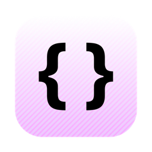

<div align="center">
  
  <h1>Bloom</h1>
  <p><strong>A macOS terminal built for the agent era.</strong></p>
  <p>
    
    
    
  </p>
</div>

Bloom is a fast, keyboard-first terminal for people who run a lot of tabs — especially tabs full of AI agents. GPU-accelerated rendering by [libghostty](https://github.com/ghostty-org/ghostty), native SwiftUI chrome, and a sidebar that actually understands what's running inside each tab.


## Download

**[⬇ Download Bloom.dmg](https://github.com/amanfromsolan/bloom/releases/latest)** — signed & notarized, no security prompts. Drag to Applications, open, done.

## Highlights

- **🪷 Spaces** — swipeable sidebar workspaces with their own tabs, folders, and pinned sessions. Overswipe past the last space to create a new one.
- **⌘T Command Center** — one fuzzy palette across tabs, spaces, and commands. `⌘1–9` quick-select, inline rename for tabs and spaces, and actions like Duplicate Tab, Close Others, Copy CWD, Open in Finder.
- **⌃Tab switcher** — most-recently-used tab cycling with a live-preview HUD, like app switching but for terminals.
- **✨ AI tab naming** — a cheap LLM call names your tabs from what's actually happening in them ("fix rate limiter", not "zsh"). Bring your own CLI: Claude, Codex, Gemini, or any custom command. Gradient shimmer while it thinks. Manual renames are sacred and never overwritten.
- **🕵️ Live process icons** — tabs show what they're running: Claude, Codex, Gemini, and Ollama get their real logos; vim, ssh, git, docker & friends get glyphs; idle shells get a quiet accent dot.
- **🧭 Live breadcrumb** — the titlebar tracks your shell's working directory as you `cd`.
- **📌 Tab lifecycle** — pin tabs to keep them forever, group them into folders; unpinned tabs quietly expire after 24h so the sidebar never rots.

## Keyboard

| Shortcut | Action |
| --- | --- |
| `⌘T` / `⌘P` | Command center |
| `⌘N` | New tab |
| `⌘W` | Close tab |
| `⌃Tab` | MRU tab switcher |
| `⌘1–9` | Jump to tab |
| `⇧⌘P` | Pin / unpin tab |
| `⇧⌘[` / `⇧⌘]` | Previous / next tab |
| `⌘,` | Settings |

## Build from source

Bloom embeds [Ghostty](https://github.com/ghostty-org/ghostty)'s `GhosttyKit.xcframework`, which isn't vendored in this repo:

```sh
git clone https://github.com/ghostty-org/ghostty references/ghostty
cd references/ghostty && zig build -Doptimize=ReleaseFast -Demit-macos-app=false
cd ../.. && xcodebuild -project Bloom.xcodeproj -scheme Bloom build
```

`script/release.sh` cuts a signed, notarized DMG (needs a Developer ID certificate and a `notarytool` keychain profile).

## Credits

Terminal emulation, PTY, and Metal rendering by [Ghostty](https://ghostty.org) — Bloom is UI and workflow on top of `libghostty`. Agent logos via [Simple Icons](https://simpleicons.org) and [LobeHub](https://icons.lobehub.com).

## License

Bloom is open source under the [GNU General Public License v3.0](LICENSE). Ghostty (MIT) and other bundled components retain their original licenses.
